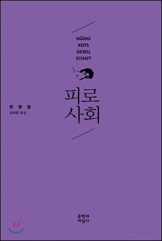

# 피로사회.
###### 2016/11/02

얇은 책인데 어려워서 포기했다가 이북으로 다시 읽음.. 맥락은 단순하다. 어렵지 않은 책이라고 생각할 수도 있다. 그러나 구절구절의 텍스트 자체는 여전히 어려운 책이다.

책의 내용과 마찬가지로, 나는 요즘 나태와 멍때리기의 중요성에 대해 관심이 있다. 어설프게 이 관점을 이야기하면 오해를 불러일으키기 쉬어서 잘 언급하지는 않는 편임..

특히 요즘의 공부 문화(?)가 지식의 카트리지를 구해서 뇌에 꽂아넣는 방식으로 이뤄지고 있고, 이 강박에 단련된 선수들이 이런 문화를 확산, 공포감을 조성하는 분위기에 불만이 있는데 책의 내용에서 지적하는 바와 일치한다. 지식과 지성은 동치가 아니며 많은 지식이 사유와 통찰과 관계없는 강박적 저장물에 다름아니고 이 지식들은 메타적 연결성이 희박하다. 즉, 지성은 사유와 통찰에서 나오고 사유와 통찰은 멍을 때려야 한다. 아는 만큼 보이므로 더 많이 알 수록, 더 많은 사람을 만나고 돌아다니고 노력할 수록 유리하다..  이런 반론이 나오는 것이 당연하긴 하지만, 인간의 시간과 체력은 유한하며, 멍을 때릴 수 있는 여분이 역사상 가장 적은 시대 아니당가? 한 편으로 개인이 보유한 스키마의 양은 어느시대보다 만타.. 아는 게 겁나 많은 헛똑똑이의 출현빈도나 민폐력도 그 어느때보다 심화된 시대다.★

...

예외적으로 수련이라는 행위의 힘은 인정하는데 수련 활동은 고도의, 계획적인, 기민한, 능동적인 멀티태스킹 활동이  아닌 경우가 많기 때문이다. (그것이 고도의 사고를 요하는 지식 수련이라할지라도 수련이라는 것은 기본적으로 싱글태스킹, 루틴한 패턴을 갖고 있다.) 그럼 니가 말하는 수련과 뇌에 지식 카트리지를 꽂는  공부법과는 뭐가 다르냐? 라고 반문하면 잘 대답은 못하겠다. 내가 이래서 피로사회 책에서 말하고자 하는 바와 내가 말하고자 하는 멍때리기에 대해서 잘 언급하지 않았던 것이었던 것이었던 것이었따..  

니 그냥 게으른고 십따는걸 인스타그램 여행사진st. 로 찌끄린거 아니가?

.. 빙고♥ ..

물론 이몸은 생각보다 부지런하답니당..

