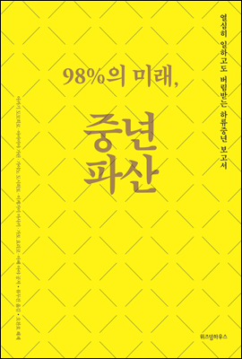

# 중년파산
###### 2016/11/08

제목이 곧 내용인데 중년 이야기는 생각보다 별로 없다. 그냥 처음부터 끝까지 우울하다.  

해법도 딱히..  

게다가 그나마 우리와는 비교할 수 없는 기초체력을 가진 일본의 이야기다. 

일, 삶, 가치관, 경제 체제, 돈, 성장에 대한 근본적인 패러다임 변화가 필요한 시점임을 누구나 말하고 있는데, 실제로 이행 할 수 있는 권력이 없다. 책의 내용에서 말하는 많은 부분은 이미 박노자의 글들을 읽으며 오래전부터 체득한 바 있다. 경제 활동에 기여하는 무엇 = 일, 그 일을 하는 기계로서의 인간, 그 대가로서의 임금. 일단 이 공식이 전환되어야 한다는 이야기다. 

...같은 이야기는 이 책엔 아주 조금 밖에 없다. 그냥 우울한 이야기다. 

특기할 만한 부분으로 "미니멀 라이프"에 관한 이야기가 있다. 필요할 때 마다 새 것을 살 수 있어야 미니멀도 가능하당게;; 없는 사람들은 언젠가 사용할 일이 있을지 모르니 쟁일 수 밖에 없다. 또는, 쌀 때 벌크로 사다 쟁일 수 밖에 없다. 이 이야기는 나도 하고 싶은 말이 많은데 다음에.. 집이라는 공간에서 살림을 하는 사람과, 살림이 아닌 휴식을 하는 사람과의 삶은 다를 수 밖에 없다. 제대로 된 휴식을 취하고자 할 때 필요한 것은 다름 아닌 돈이다. 멍때릴 수 있는 시간을 확보하려면 돈이 든다.

마지막 절에서도 그다지 우울한 분위기를 벗어나지 못하고 있는데, 이런 사회적 불안감이 그나마 있는 사람들마저 자식들에게 프리터를 시킬 수 없다 생각하여 돈을 안 쓰고 경제적 하위층 사람들은 더욱 더 나락에 떨어진다는 이야기를 하고 있다. 

그리고 그 문장을 보는 사람들, 그러니까 책을 읽을 수 있는 여가에 돈을 쓸 수 있는 사람들이 "나라도 돈을 더 써야지" 라고 생각을 할 수는 없을 것이다. 

대략... 우울하다.

페이스북 내용 추가 :
> 사내 도서관에 구매 신청했다가 못 읽고 반납 -_-; 이북을 다시 사서 읽음.
결론 : 개우울. 개답답.
마땅한 해법 제시는 없다. 해법은 어차피 권력이 있는 자들이 집행 할 수 있는 것인데 없는 놈들끼리 아옹다옹 뭐 해봐야 고독사 방지나 히키코모리를 양지로 끌어내는 수준이다. 이 마저도 그저 세금 내는 기계를 하나라도 고치는 행위라고 생각하면 더욱 우울해진다.
게다가 우리보다 훨씬 강한 체력을 갖고 있는 일본의 이야기다.
 
