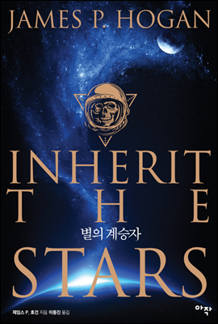

# 별의 계승자
###### 2016/11/14

별의 계승자, 제임스 P. 호건.  

소장가치가 있는 책이라 종이책을 살까 하다가, 좁은 집의 가처분 공간들을 차지하고 있는 읽지 않은 책들을 보며 그냥 원스토어 이북으로 사서 읽었다.

무려 1977년작이다. 1977년은 보이저가 심우주를 향한 여정을 출발한 바로 그 해이며, 내가 태어난 해이기도 하다. 1977년임을 강조하는 이유는, 이 SF 소설의 세계관이 1977년작이라고는 믿을 수 없을 정도로 정교하고 과학적이기 때문이다. 바로 엊그제 탈고된 소설이라고 믿어도 될 것 같다.;;

이 소설에 비한다면 어렸을때 읽은 이런저런 SF 소설들의 세계관이라는 것은 요즘 분류로 스페이스 오페라에 가까운 판타지 장르였다. "별의 계승자"는 학회 SF라는 별명이 어울릴 정도로 내용 전개를 학자들의 과학적 논리 전개에 의존하는 한편, 지극히 개인적인 주인공 1인의 흐름을 타고 인류 역사의 거대한 비밀을 밝혀낸다. 

아서 클라크 소설들도 그렇고, 이런 걸작 SF들을 읽을때마다 느끼는 점은 요즘의 SF라는 것은 선각자들이 세워놓은 세계관의 동어 반복이라는 것이다. 새로운 것을 쓰기가 더욱 어려워졌다. 

감상평은 책소개로 대체한다. 안 읽을 수가 없는 것이다.

>SF 마니아들이 가장 사랑하며 복간을 기다려온 작품,  
세계적 SF 작가 제임스 P. 호건의 대표작 드디어 복간!  
>달에서 5만 년 전 우주비행사의 시체가 발견되었다  
우주복 안의 유골은 인류와 똑같은 호모 사피엔스  
과연 그는 5만 년 전에 어떻게, 왜 달에 갔는가  
상상을 뛰어넘는 반전의 결말과 인류 기원의 수수께끼   
>일본의 권위 있는 SF문학상 성운상을 세 번이나 수상한, 세계적인 SF 작가 제임스 P.호건의 대표작. 일본 SF 문학상을 수상하고, [기동전사 Z건담], [신비한 바다의 나디아] 등 유명 애니메이션들이 앞다투어 오마주했고, 호시노 유키노부가 만화화해서 만화판 역시 2013년 성운상을 수상하기도 했다. 

