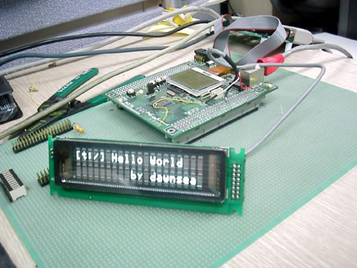
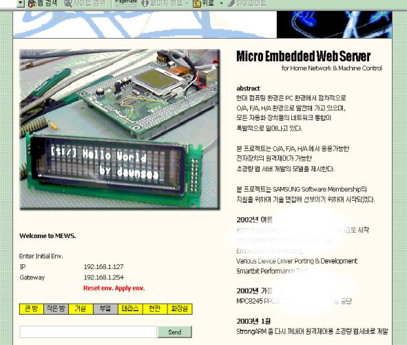

# 스트롱암 홈네트워크
###### 2003/01/03

Strong ARM을 이용한.. 홈네트워크... 라고 하기엔 빈약하지만...

인터넷을 통해 집으로 문자를 보내거나 불을 켜고 끌 수 있다. 간단한 로그인 체계를 넣어서 보안성을 향상.... 시켰다고는 하지만 -_-;; 보안성은 그냥 없다고 봐야 한다.

이 보드와 어울림정보에서 만들었던 ezWall 소개 자료를 들고 삼성소프트웨어 멤버십 기술면접을 봤다.

나중에 할로겐 조명도 넣었다. 할로겐은 PWM을 이용한 조도 제어가 된다. 할로겐은 아마도 12V에 대용량 전류를 끌어쓴 관계로 TR을 하나 넣었다. PWM  주파수를 너무 높여서 TR을 태운 기억이 난다.

문자 패널은 VFD이다. 구식 오디오에 들어갔던 뽀대 넘치는 물건이다. 시리얼 통신을 지원하기 때문에 그냥 날데이터 날리면 그대로 표시된다.

원래는 MP3를 만들 수 있던 스트롱암 보드였던 것으로 기억한다. 웹서버는 go ahead, boa, lighttpd를 골고루 이용해보았고, 웹쪽은 결국 C언어 cgi를 썼다. 포트 제어가 그쪽이 편하다.

이런 홈네트워크는 개별적 구현에 있어서는 쉽다. 그런데도 HA 시장은 지지부진하다. 메이저가 없고, 누가 메이저에 오를까봐 협회를 만들어 견제하고, 표준화를 둘러싼 견제만이 있다. 

